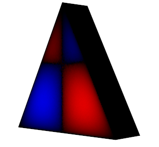

# Table of Content
1. [Real-time Fluid Dynamics Solver (Stam Fluid)](#real-time-fluid-dynamics-solver-stam-fluid)
    * [Instruction](#instruction)
        * [Controls](#controls)
        * [Fluid Configuration](#fluid-configuration)
        * [Run](#running-from-executable)
2. [PDE Sovler with Walks on Sphere](#pde-solver-with-walks-on-sphere)

# Real-time Fluid Dynamics Solver (Stam Fluid)
Implementation of ["Real-Time Fluid Dynamics for Games"](https://www.dgp.toronto.edu/public_user/stam/reality/Research/pdf/GDC03.pdf) by Jos Stam

## Instruction
### Controls
`S` - Start

`Space` - Stop

`Left Click` - Add density

`Right click and drag` - Add force

`V` - View velocity/force

`D` - View density

`C` - Clear

### Fluid Configuration
To generate `config.csv`, modify and run the [script](fluid%20config/createConfig.py).
### Running from executable
Download `config.csv` `SDL2.dll` `stamFluidx64.exe` from [`Demo`](Demo) or from `Release` and put them in the same folder
### Running from Visual Studio
This project works with Visual Studio 2019.

# PDE Solver With Walks on Sphere
Implementation of [Monte Carlo Geometry Processing:A Grid-Free Approach to PDE-Based Methods on Volumetric Domains](https://www.cs.cmu.edu/~kmcrane/Projects/MonteCarloGeometryProcessing/paper.pdf) by Rohan Sawhney and Keenan Crane

